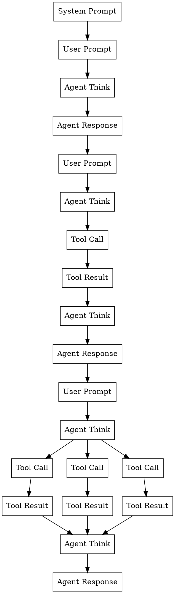

# LLM Tracer

## Goal

Create a cross-platform lightweight desktop application to visualise the DAG in LLM agent messaging history.

## Functions

- parse message history files (`.jsonl` files) from different sources (claude/codex/openclaw/...) to build a universal IR
- render the IR as DAG in different themes, including
    - dots: all messages are represented as dots and edges are straight lines.
    - bricks: all messages are represented as rectangles and parallel tool callings and results are represented as 
- allow user to inspect each node/brick and to turn on/off markdown render while inspecting in details.

## Mental Model

Each trajectory can oftem be mapped like a DAG. Below is one example.

## Stack

- Prefer Rust + Tauri, use typescript if have to.

## Examples

sample agent message history files can be found in `samples` folder.
